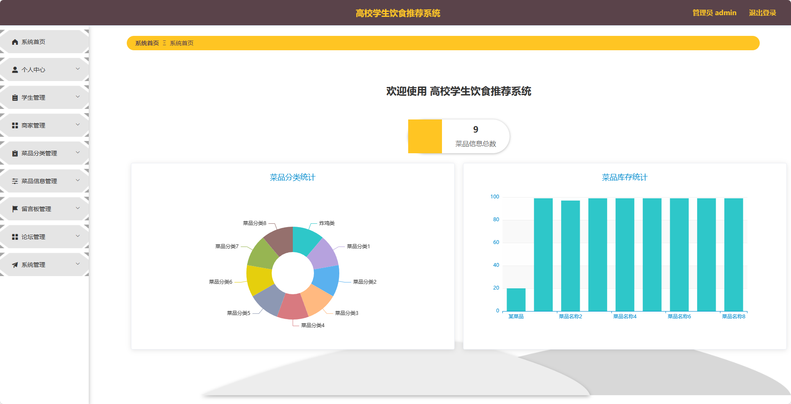
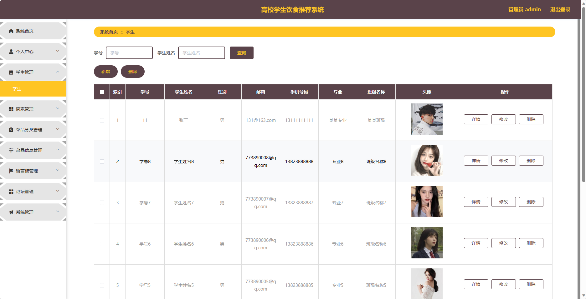
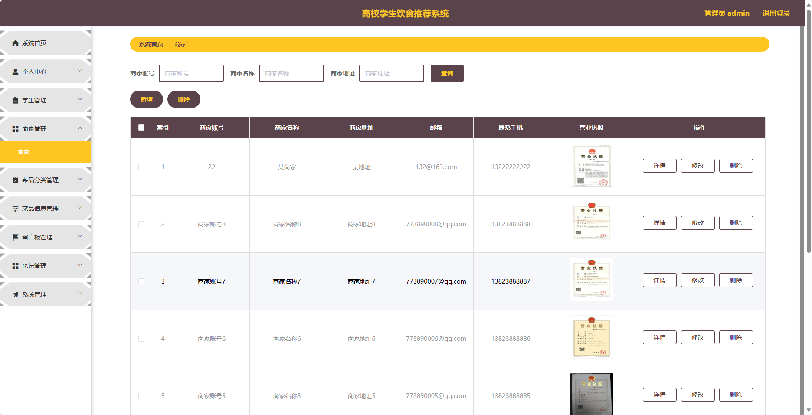
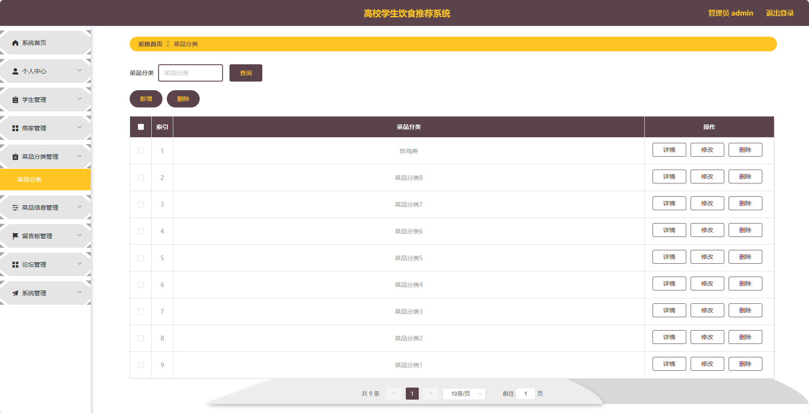
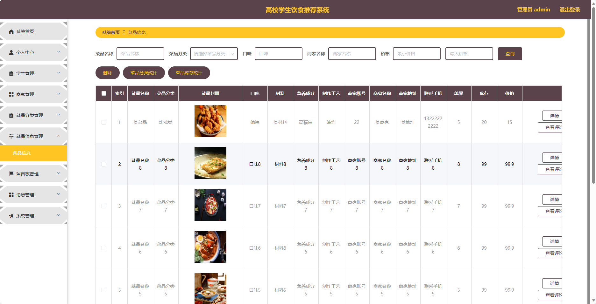
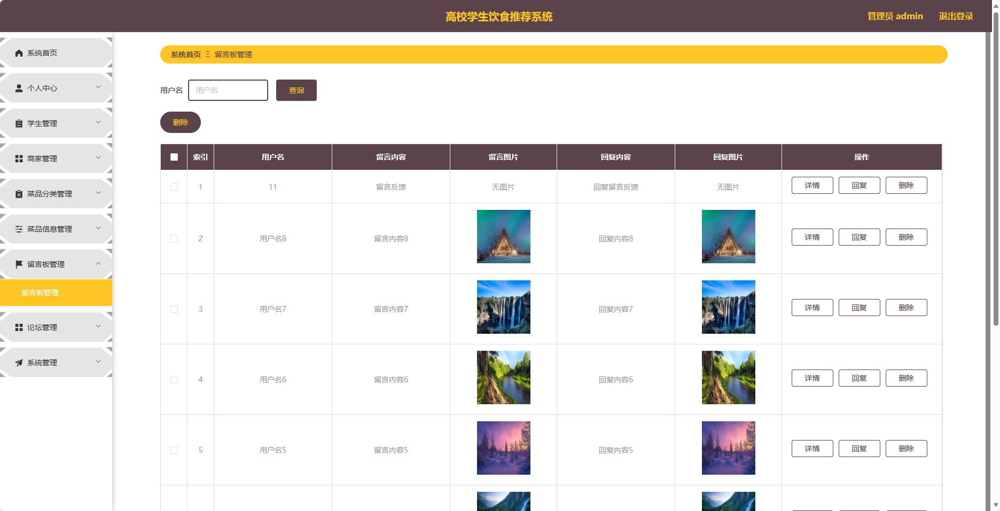
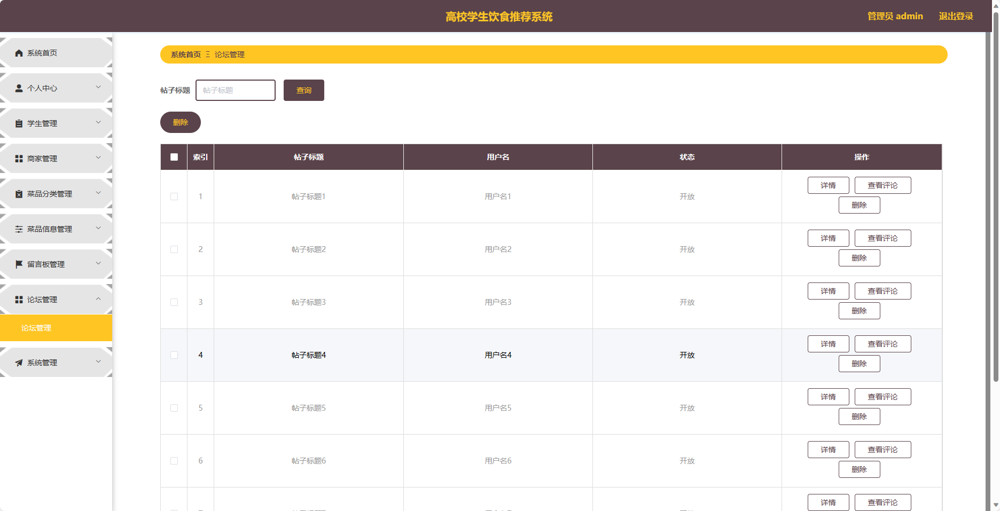
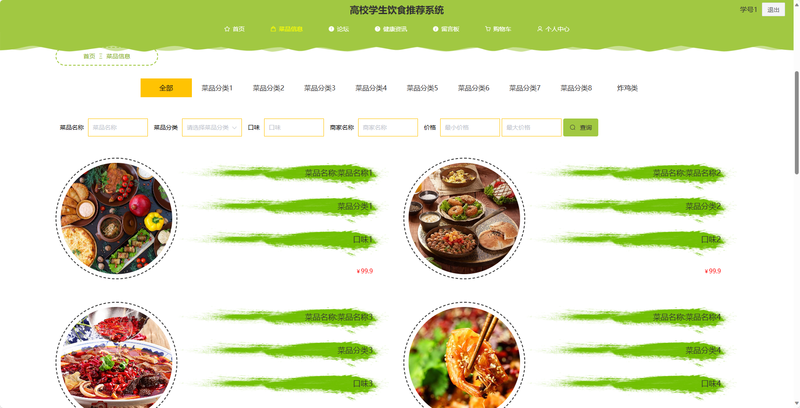

## 基于SpringBoot的高校学生饮食推荐系统

###  获取sql数据库文件: 从戎源码网 (https://armycodes.com/) QQ: 386869957 QQ群: 377586148
###  所有系统地址: (https://github.com/YuLin-Coder/AllProjectCatalog) 
###  所有项目以及源代码本人均调试运行无问题 可支持远程安装部署调试、定制修改、代码讲解

## 项目介绍
基于SpringBoot的高校学生饮食推荐系统，系统包含两种角色：管理员、学生、商家,系统分为前台和后台两大模块，主要功能如下。

### 【管理员】:
- 个人中心：管理管理员的个人信息，包括修改密码等操作。
- 学生管理：管理学生的个人信息，包括查看学生列表、禁用学生等操作。
- 商家管理：管理商家的个人信息，包括查看商家列表、禁用商家等操作。
- 菜品分类管理：管理系统中菜品的分类信息。
- 菜品信息管理：发布和管理菜品信息，包括添加菜品、编辑菜品、删除菜品等操作。
- 留言板管理：管理留言板中用户的留言信息，包括查看留言列表、回复留言等操作。
- 论坛管理：管理论坛中用户的发帖和回帖情况，包括查看帖子列表、回复帖子等操作。
- 系统管理：管理系统的基础数据，如学院信息、专业信息等。

### 【商家】:
- 个人中心：管理商家的个人信息，包括修改密码等操作。
- 菜品信息管理：发布和管理商家的菜品信息，包括添加菜品、编辑菜品、删除菜品等操作。
- 订单管理：管理商家的订单信息，包括查看订单列表、确认订单等操作。

### 【前台】:
- 首页：展示系统的概览信息、推荐菜品等内容。
- 菜品信息：用户可以查看、搜索、筛选菜品信息。
- 论坛：用户可以在论坛中进行交流、分享经验等。
- 健康资讯：提供各种健康饮食相关的资讯。
- 留言板：用户可以在留言板上留下自己的建议和意见。
- 购物车：用户可以将心仪的菜品加入购物车。
- 个人中心：用户管理个人信息，包括修改密码、查看订单等操作。

## 项目技术
- 编程语言：Java
- 数据库：MySQL
- 项目管理工具：Maven
- 前端技术：HTML、CSS、JavaScript、Jquery、Vue
- 后端技术：Spring、SpringMVC、MyBatis

## 运行环境
- JDK版本：JDK1.8及以上
- 开发工具：IDEA、Ecplise、Myecplise都可以
- 数据库: MySQL5.7及以上
- Maven：maven3.0及以上
- Node：14.14.0及以上

## 运行截图

